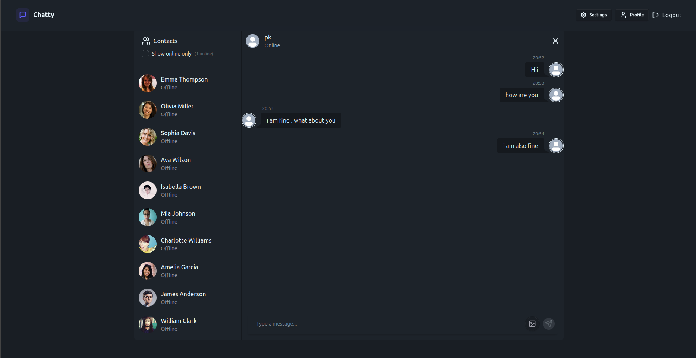

#  Full Stack Realtime Chat App 

A modern, responsive, and feature-rich chat application built with the **MERN Stack** and **Socket.io**. This project features real-time messaging, user status tracking, image uploads via Cloudinary, and a highly customizable UI with 32 themes.



---

##  Features

- **Real-Time Communication**: Instant messaging and online user status using Socket.io.
- **Robust Auth**: Secure Authentication and Authorization with JWT (stored in cookies).
- **Media Support**: Upload and send images seamlessly via Cloudinary.
- **State Management**: Clean and efficient global state handling with Zustand.
- **Customization**: 32 beautiful themes powered by Daisy UI and TailwindCSS.
- **Responsive Design**: Fully optimized for Desktop, Tablet, and Mobile devices.
- **Error Handling**: Graceful error management on both Server and Client sides.

---

##  Tech Stack

- **Frontend**: React.js, TailwindCSS, Daisy UI, Zustand, Lucide React.
- **Backend**: Node.js, Express.js.
- **Database**: MongoDB (Mongoose).
- **Real-time**: Socket.io.
- **Storage**: Cloudinary (for profile and chat images).

---

## Installation & Setup

### 1. Clone the Project
```bash
git clone <your-repository-url>
cd <your-project-folder>
